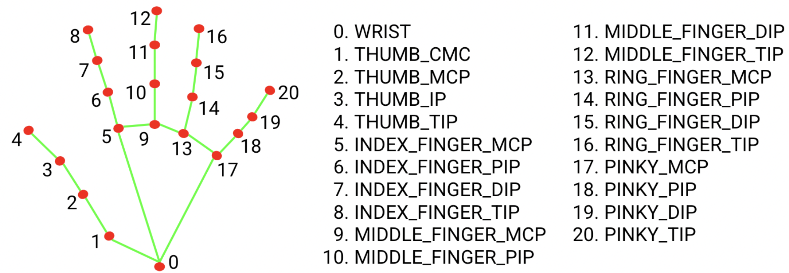
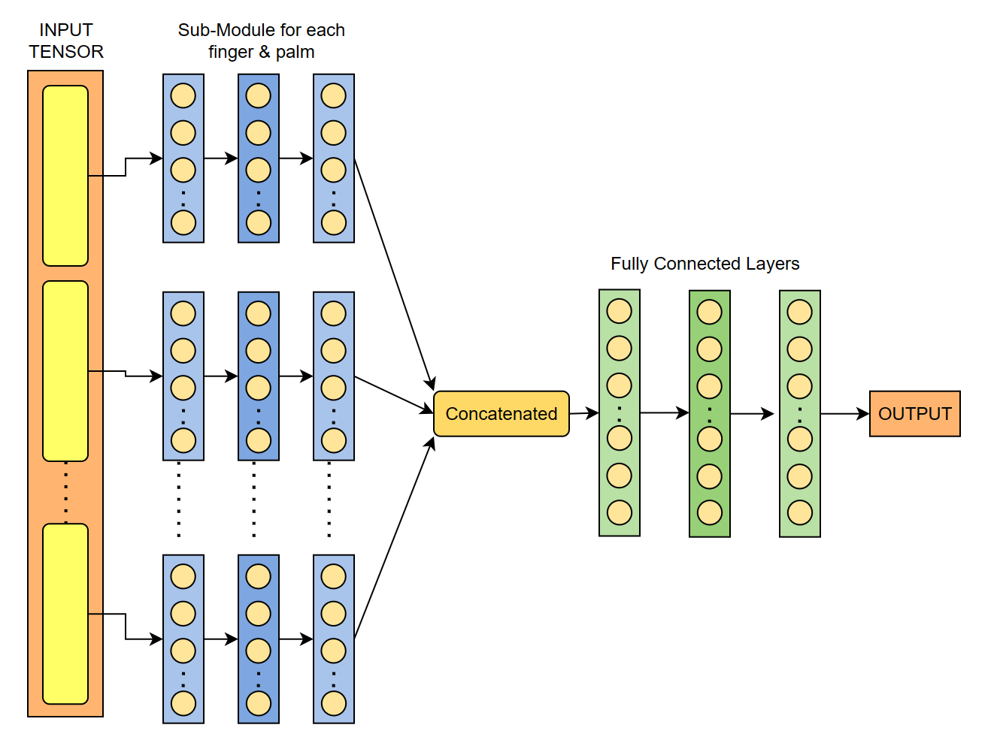

# Gesture-Based Media Control System

## Overview

This project enables media control using custom gestures. By leveraging hand landmark detection technology, users can interact with media playback and other system functionalities using hand movements. This README provides information on how to set up, configure, and use the gesture-based media control system.

## Table of Contents

- [Usage](#usage)
- [Method](#method)
- [Installation](#installation)
- [Create custom Gestures](#create-custom-gestures-and-commands)

## Usage

1. **To use gesture media controller, simply run the execution.py file.**

2. **Following are the present functionalities added.**
    - Palm: Pause/Play
    - Thumbs-up: Volume up
    - Thumbs-down: Volume down
    - Thumbs-left (neutral): Mute/unmute
    - V-up (2 fingers): Brightness up
    - V-down: Brightness down
    - Point-left: Previous track
    - Thumb-right: Next track

3. **The fist is a neutral gesture and you can use that as an intermediate between two consecutive pause/play or other toggle functions.**

## Method

### Data Collection

The project makes use of *OpenCV* to access the webcam of the device. A python script (collect_images.py) is used to capture 500 images of each class at sample rate of 20 images per second into a *data* folder. Another script (extract_marks.py) is used to extract the coordinates of each landmark of the hand detected using *Medipipe Hand-Landmarker* and save the list of data-points into a pickle format.

<div style="text-align: center;">
  
</div>

<div style="text-align: center;"> Taken from [1] </div>

### Training

During training, the pickled data-points are loaded. Cross-entropy Loss is used to calculated the loss ie. deviation from actual labels. Adam optimizer is then used to update the weights with momentum using the gradients calculated by back-propagation.

### Neural Network Archicture

The neural network has a sub-module for each of the fingers and the palm (which includes base of each finger) ie. six in total. The outputs from these sub-modules are then concatenated and sent further to fully connected layers. The last layer (self.fc3 of class Gesture) has as many outputs as many predictions we need (10 in out case).

<div style="text-align: center;">
  
</div>


### Deployment

During the execution phase, individual images are read through the webcam and passed to the *Mediapipe Hand-Landmarker* which returns the x,y,z coordinates of each landmark in a detected hand (labelled 0-20). The coordiantes are passed to the neural network model. The softmax of the model prediction is passed to the control function. The function accepts an integer-key for which a corresponding action is taken place. Corresponding to each int-key there is a dictionay storing its associated *Virual Key code*. The key press is then simulated using pywin32. 

## Installation

1. **Clone the Repository:**
   ```bash
   git clone https://github.com/rachkoshy/gesture-based-media-control.git

2. **Install required packages from the requirements.txt file**
   ```bash
   pip install -r requirements.txt

## Create custom Gestures and commands

1. **Use the collect_images.py script to scan your own gestures. Set the number of classes and dataset size as per your requirements.**

2. **Use extract_marks.py to detect and save the marks from the data created as data.pickle.**

3. **Train the model using train.py. Adjust the parameters as per your requiremets and save the weights.**

4. **Access the weights in execution.py and run it. You can uncomment out imshow if you prefer to see the live capture.**

5. **To create custom commands, you can simulate any button press by specifying the Virtual Key Code Associated with it. Simply add the key code next to the associated numerical key in the gestures dictionary.**

## References

[1] https://developers.google.com/mediapipe/solutions/vision/hand_landmarker
